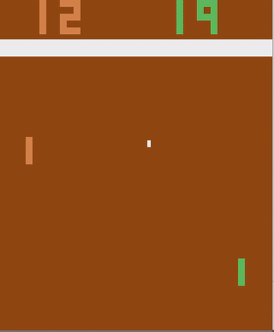
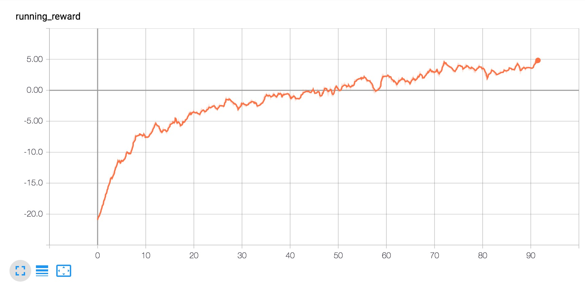
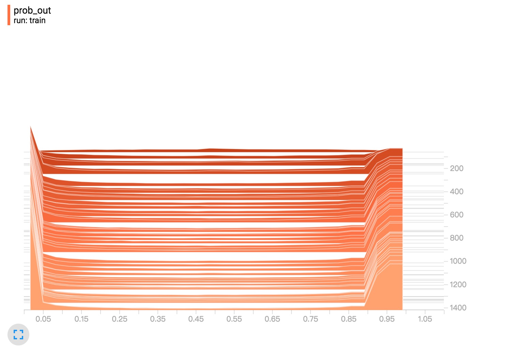

# policy-gradient-pong

### Reinforcement learning approach to win Atari game pong. 
### tenforflow implementation of [Andrej Karpathy's original numpy version](http://karpathy.github.io/2016/05/31/rl/).


## dependencies
* tensorflow
* numpy
* openai gym

## usage
### train:
```
python policy_gradient_pong.py
```

### demo:
```
python policy_gradient_pong_demo.py <checkpoint path>
```

we provide trained weights in the folder *weight/* which can beat computer with high probability.

## notice
It takes very long time, about 90 hours on a dell RX 730 with a **Intel(R) Xeon(R) CPU E5-2603 v3 @ 1.60GHz** 8 cores CPU, 16G RAM and a gtx 1080ti GPU, to win computer by 5 scores.

It takes much shorter time to train on a 2016 mac book pro without GPU. So i think much of the time spent on simulation, rather than network forward and backward.

## training progress





